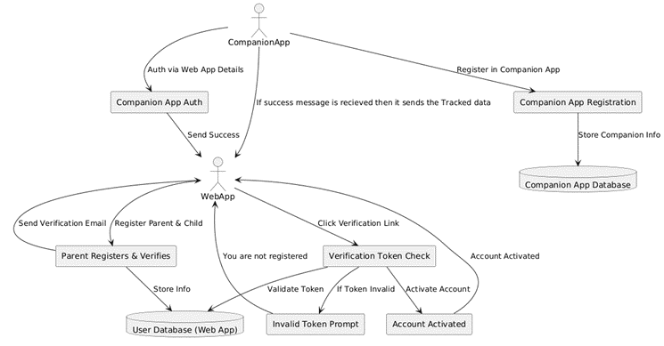
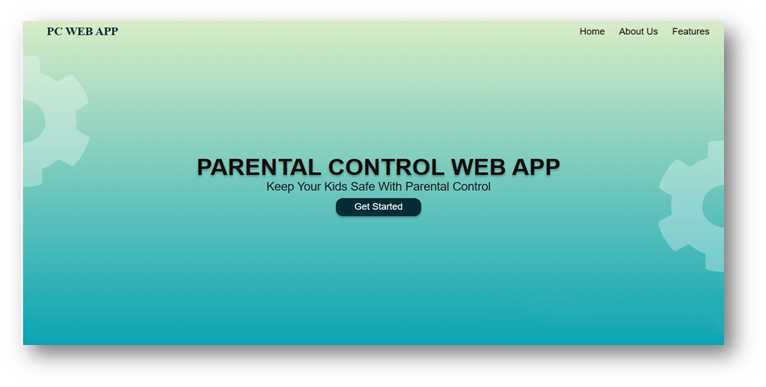
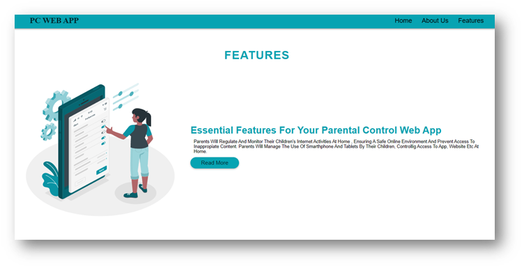
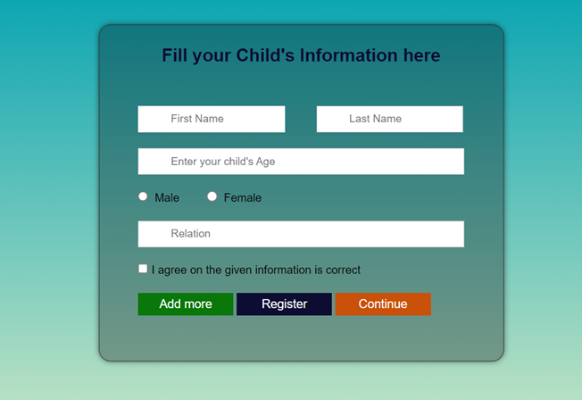
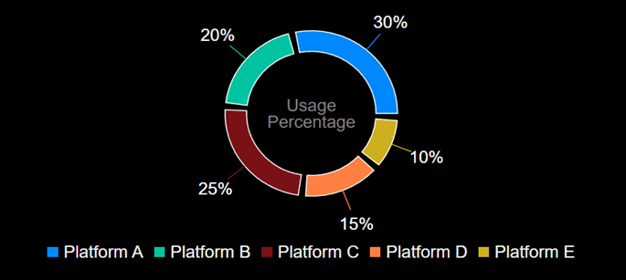
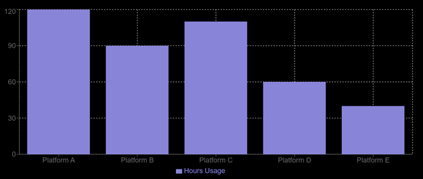
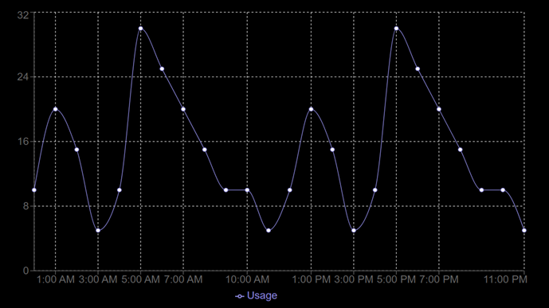

<h1>🛡️ Parental Control Web Application</h1>

<h2>📌 Project Overview</h2>

The <strong>Parental Control Web Application</strong> is a secure and scalable web-based system designed
to help parents monitor, manage, and control their children’s digital activities.
The application emphasizes strong security, structured user management,
and seamless backend–frontend integration.

<h2>🎯 Problem Statement</h2>

With increasing digital exposure among children, parents often face difficulties
in monitoring online activities and controlling access effectively.
This project provides a centralized, secure, and user-friendly solution
to address these challenges using modern backend technologies.

<h2>🚀 Features Implemented (Current Status)</h2>

<h3>👨‍👩‍👧 Parent Module</h3>
<ul>
  <li>Secure parent registration and login</li>
  <li>Token-based authentication using Spring Security</li>
  <li>Dashboard for monitoring child activity</li>
  <li>Data visualization support</li>
</ul>

<h3>👶 Child Module</h3>
<ul>
  <li>Child profile registration under parent account</li>
  <li>Controlled access and data association</li>
  <li>Backend-ready activity tracking</li>
</ul>

<h3>🔐 Security</h3>
<ul>
  <li>JWT-based authentication</li>
  <li>Password hashing</li>
  <li>Role-based access control</li>
  <li>Spring validations</li>
</ul>

<h3>🗄️ Database</h3>
<ul>
  <li>Relational database design using MySQL</li>
  <li>Optimized SQL queries</li>
  <li>JDBC-based data access</li>
  <li>Efficient data flow between layers</li>
</ul>

<h2>📊 System Architecture & Data Flow</h2>
<h3>Data Flow Diagram</h3>

<h2>🖥️ User Interface Screens</h2>

<h3>🏠 Home / Initial Pages</h3>

  

  

  

<h3>📝 Sign Up Page</h3>

<h3>👶 Child Registration Page</h3>

<h3>📊 Dashboard & Visualizations</h3>

  

  

<h2>🛠️ Tech Stack</h2>

<h3>Backend</h3>
<ul>
  <li>Java</li>
  <li>Spring Boot</li>
  <li>Spring MVC</li>
  <li>Spring Security</li>
  <li>JDBC</li>
  <li>MySQL</li>
</ul>

<h3>Frontend</h3>
<ul>
  <li>Thymeleaf</li>
  <li>HTML</li>
  <li>CSS</li>
  <li>JavaScript</li>
</ul>

<h2>👨‍💻 My Role & Contribution</h2>
<ul>
  <li>Developed the complete backend architecture</li>
  <li>Implemented JWT-based authentication using Spring Security</li>
  <li>Built secure register and login flows</li>
  <li>Designed and integrated MySQL database schema</li>
  <li>Optimized SQL queries and managed data using JDBC</li>
  <li>Ensured secure and scalable backend services</li>
</ul>

<h2>📱 Mobile Application Status</h2>

The mobile application is currently in the <strong>designing phase</strong>.
UI/UX planning and architecture alignment are in progress.

<h2>📈 Key Achievements</h2>
<ul>
  <li>Built a secure backend system from scratch</li>
  <li>Applied industry-standard authentication and security practices</li>
  <li>Designed an efficient and optimized database architecture</li>
  <li>Delivered a real-world, problem-solving major project</li>
</ul>

<h2>🔮 Future Enhancements</h2>
<ul>
  <li>Mobile application development</li>
  <li>Advanced activity analytics</li>
  <li>Notification and alert system</li>
  <li>Cloud deployment</li>
</ul>

<h2>📌 Project Type</h2>

<strong>Major Academic Project</strong>

<h2>📄 License</h2>

This project is developed for academic and learning purposes.

